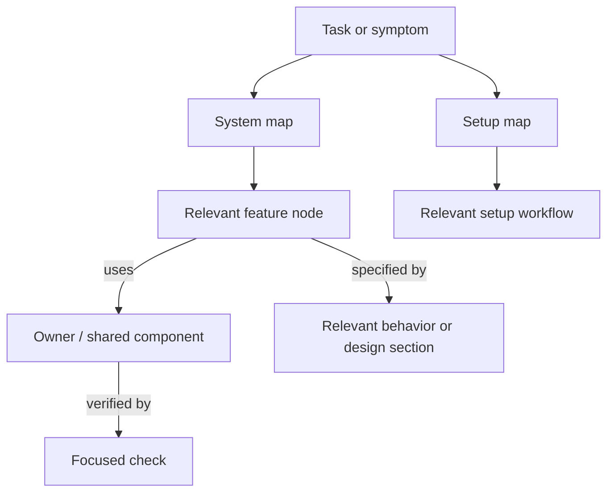

# Task-to-document map

Updated: 2026-09-14. Start with the row closest to the task; read one feature node and follow only relevant edges.

| Task | Entry |
| --- | --- |
| Create/add a feature with Astra–Luna roles | [Feature delivery loop](workflows/FEATURE_DELIVERY_LOOP.md) |
| Change behavior, component or record flow | [System map](maps/SYSTEM_MAP.md) |
| Run locally, configure services, schema workflow or release | [Setup map](maps/SETUP_MAP.md) |
| Home banner, summary, calendar or Recruitment Records tables | [SYS-HOME F10/F11](maps/system/home.md#f10-home-metrics-recruitment-events-calendar-and-tabbed-records) → [Home design](design/home.md#recruitment-records) → [Home tests](../tests/e2e/home-candidate-pipeline.spec.ts) |
| Workspace picker, linked-requisition popup, selected header or tabs | [SYS-WORKSPACE F00](maps/system/workspace.md#f00-groups-picker-selected-group-header-journey-and-tabs) → [picker](design/workspace.md#picker-at-workspace) / [header](design/workspace.md#selected-case-header-and-section-navigation) → [Workspace tests](../tests/e2e/workspace.spec.ts) |
| Workspace Overview journey or data quality | [SYS-WORKSPACE sections](maps/system/workspace.md#f00-section-presentation-search-keys) → [Overview design](design/workspace.md#overview) → [Workspace tests](../tests/e2e/workspace.spec.ts) |
| Workspace Sourcing summary, donut, stage bars, week list or editor | [SYS-WORKSPACE Sourcing](maps/system/workspace.md#f00-section-presentation-search-keys) → [Sourcing design](design/workspace.md#sourcing-pipeline-offer-activity) → [Workspace tests](../tests/e2e/workspace.spec.ts) |
| Audit Log filters, actor, table or field changes | [SYS-RECORDS F30](maps/system/records.md#f30-audit-log-presentation) → [design](design/audit.md) → [focused test](../tests/e2e/ux-enhancements.spec.ts) |
| Requisition Detail drawer | [SYS-RECORDS](maps/system/records.md) → [Requisition Detail design](design/requisition-detail.md) |
| Candidate profile, journey or stage activity | [SYS-PIPELINE](maps/system/pipeline.md) → [Candidate design](design/candidate-detail.md) |
| Fail Candidate reasons, Configuration catalog controls or refresh | [SYS-PIPELINE F22](maps/system/pipeline.md#f22-candidate-pipeline-boardrecord-register) → [Pipeline behavior](WEBSITE_STRUCTURE.md#recruitment-workflows) → [catalog test](../tests/e2e/rejection-reason-admin.spec.ts) |
| Waterfall/requisition export, Pipeline Health layout, Source details or PNG | [SYS-REPORTING F04](maps/system/reporting.md#f04-dashboard-report-views-exports-and-xlsx) → [Dashboard behavior](WEBSITE_STRUCTURE.md#dashboard-page) → [dashboard test](../tests/e2e/dashboard-reports.spec.ts) |
| Date selector or dropdown | [Control contract](design/controls.md) → [SYS-PLATFORM](maps/system/platform.md) |
| Shared type/color hierarchy | [Foundations](design/foundations.md) → affected system node |

## Graph reading rule

Nodes are feature owners, shared components, contracts and setup workflows. Edges name relationships: `uses`, `reads`, `opens`, `embeds`, `invokes`, `updates`. Follow the shortest relevant path from the symptom to its owner; do not walk the entire graph. Reverse edges identify consumers to check after a shared change.

Stop expanding once the owner, relevant contract and verification target are identified. Cycles such as Workspace → Records → Workspace represent navigation, not instructions to reread nodes; visit each node at most once per investigation unless new evidence requires it.

Keep one owner for each rule. Maps contain links/search keys, not copied policy. Update a feature's node when ownership changes and update its impact back-links when dependencies change. Shared nodes with many consumers deserve caller inspection; they do not require all documentation to be loaded.

Validate maintained links and graph structure with `python scripts/check_agent_docs.py`. The current feature inventory is F00–F27 across seven nodes; when intentionally extending the graph, update its expected inventory in the checker with the map. [Verification boundaries](workflows/TEST_ENVIRONMENTS.md) distinguish structural validation from application behavior tests.

Find symbols quickly: `rg -n "DayDateSelector|CandidateDetailHeader" docs/maps docs/design src` from the app checkout. Do not treat sibling checkouts or archived documentation as the active source.
