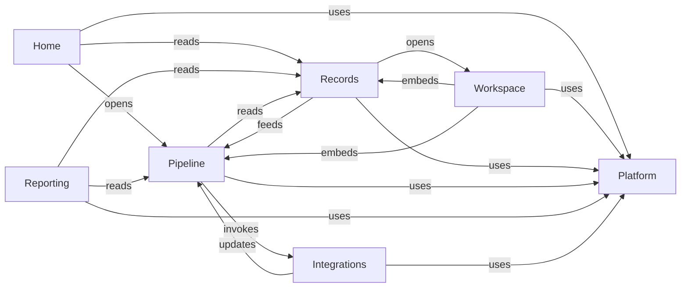

# System map

Purpose: find product behavior, UI owners and change impact. [Setup](SETUP_MAP.md) separately owns environment and release routing. Start at one node; edges are a curated change-navigation graph, not an exhaustive runtime dependency model.

| Node | Task | Primary boundary |
| --- | --- | --- |
| [SYS-HOME](system/home.md) | Banner, summaries, calendar, work queue | HomeView / RecruitmentCalendar |
| [SYS-WORKSPACE](system/workspace.md) | Case selection, URL context, embedded sections | HiringWorkspaceView / dispatcher |
| [SYS-RECORDS](system/records.md) | Requisitions, sourcing, offers, confirmation | Record views and form/RPC callers |
| [SYS-PIPELINE](system/pipeline.md) | Candidate Detail, stages, rounds and history | RecruitmentWorkspace / StageRail / PipelineBoardView |
| [SYS-REPORTING](system/reporting.md) | Waterfall, report filters, exports | VacancyWaterfallView |
| [SYS-PLATFORM](system/platform.md) | Dates, dropdowns, theme, shell, language, roles | Shared primitives and helpers |
| [SYS-INTEGRATIONS](system/integrations.md) | Interview/rejection behavior | Server routes and external contracts |

For a visual change, use the node's design contract. For a behavior change, use its canonical behavior section. For a shared primitive, inspect reverse consumers in that node. Cross to Setup only for environment, schema or release work.

Examples: calendar typography → SYS-HOME → Home design → RecruitmentCalendar; wrong date value → SYS-PLATFORM → date contract → Field and caller; candidate profile layout → SYS-PIPELINE → Candidate design → DetailGrid. A data issue follows the node's data owner and, only for schema work, SETUP-DATABASE.
