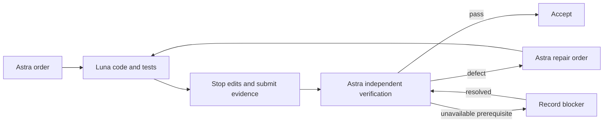

# Feature delivery loop

Workflow ID: SETUP-FEATURE-LOOP. Updated: 2026-09-14.

Astra defines acceptance and independently verifies; GPT-6 Luna at medium writes code/tests and repairs failures. This is an execution convention, not a background scheduler.

## Choose a role

- [Astra coordinator](feature-loop/astra.md): order, delegate, review, verify and accept.
- [Luna worker](feature-loop/luna.md): execute the supplied order directly; never delegate or start another coordinator loop.

Do not read both role contracts by default. Actual model selection must match the role. A worker is not subject to the coordinator's Astra-model check.

## Scale the record to the task

| Change | Record |
| --- | --- |
| Small bounded feature | One compact order and evidence/verdict in the handoff; no mandatory work-item folder |
| Multi-step, cross-domain or externally integrated change | Versioned order, implementation evidence and review under `docs/work-items/<feature-slug>/` |

Both modes preserve the same roles and acceptance standard. Required fields: outcome, scope, checkout, relevant contracts, observable acceptance criteria, appropriate checks and authorization boundary. Add process detail only when it supports a real decision.

## Completion

Luna's report is evidence, not acceptance. Astra verifies all in-scope criteria against the handed-off source state. Later changes invalidate affected results. Routine repairs proceed without repeated user approval. After repeated unsuccessful repairs, re-plan the affected slice rather than weakening acceptance.

Report environmental limits as unverified, not passed. Release is included only when authorized. Use [test boundaries](TEST_ENVIRONMENTS.md) for verification and [Setup](../maps/SETUP_MAP.md) only when environment/schema/release work is relevant.
